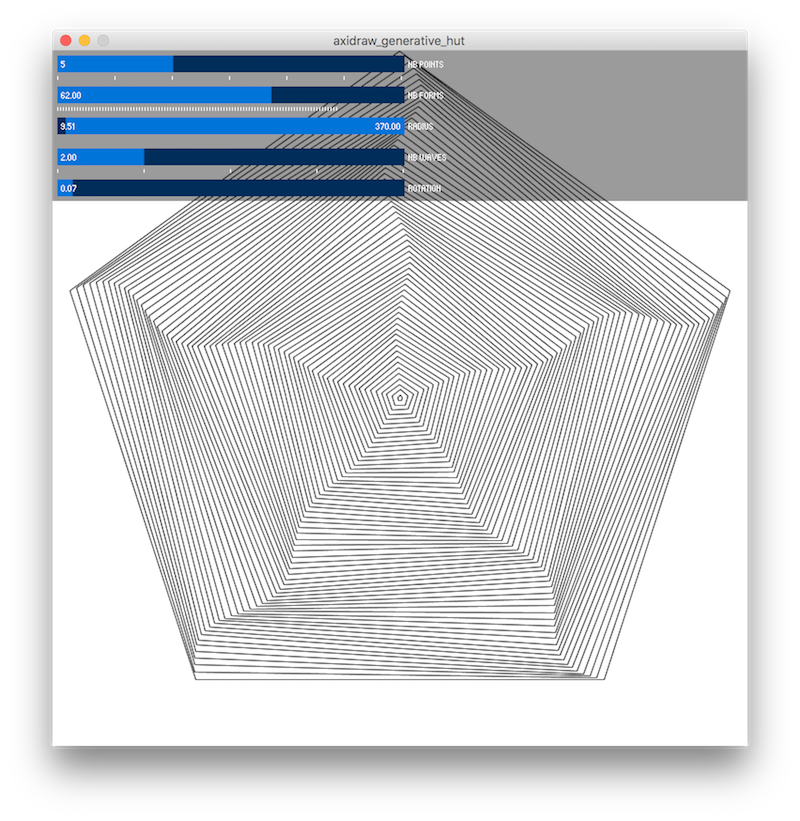
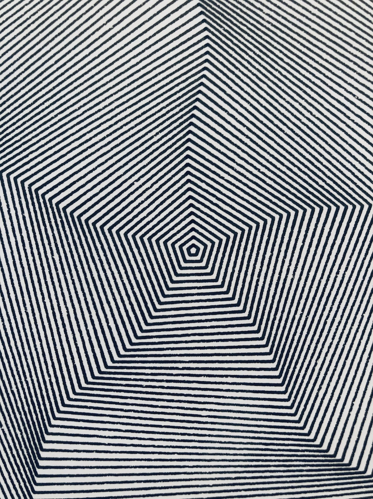

# Tutorial Processing + Axidraw for Generative Hut
The tutorial aims at creating a tool to generate geometric forms that are based on a simple set of rules involving a combination of 2D transformations and repetition. The resulting forms can be then printed with the axidraw plotter.

https://www.generativehut.com/post/axidraw-processing

